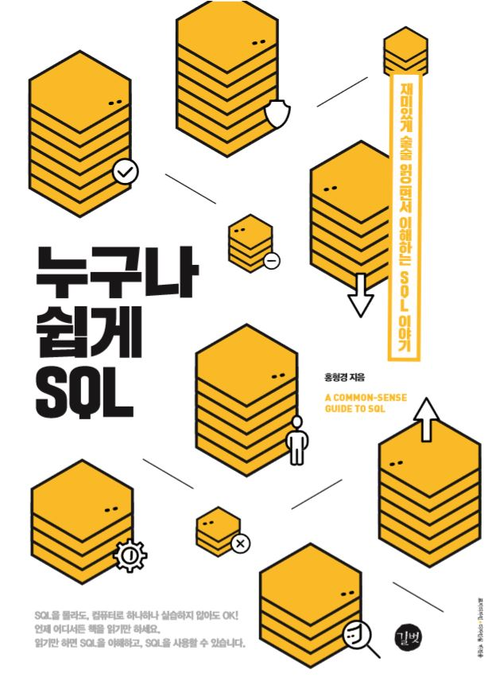

# 누구나 쉽게 SQL

## 예제 파일 내려받기
이 책에 수록된 모든 SQL 문장과 데이터 입력에 필요한 SQL 문을 제공합니다. 다음 웹사이트를 참조하세요.
- 길벗출판사 웹사이트: https://www.gilbut.co.kr/ 
- 길벗출판사 깃허브: https://github.com/gilbutITbook/080202

## 예제 파일 구조 및 참고 사항
- 책에 수록된 모든 SQL 문장과 데이터 입력에 필요한 SQL 문을 장별로 구분해 놓았습니다.
- 3장부터 12장까지 각각 폴더로 구분되어 있으며 1, 2장은 실습이 없으므로 해당 폴더는 없습니다. 

